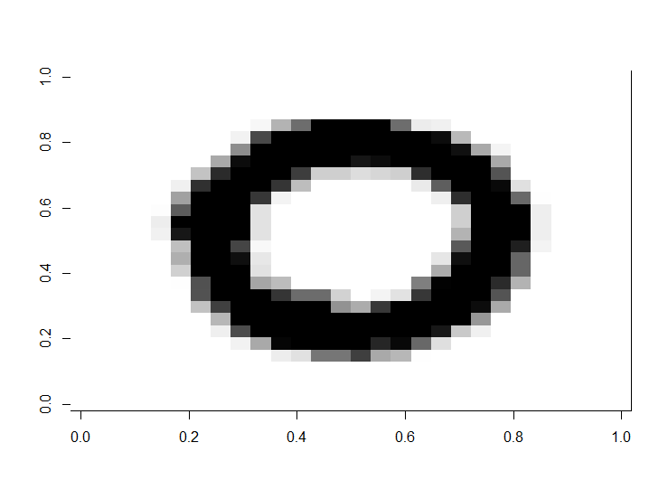
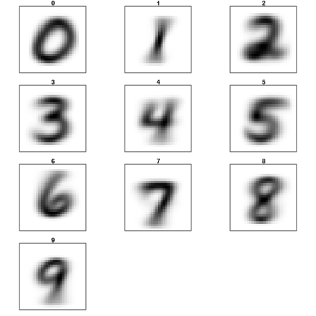

# Digit Recognizer

Classify handwritten digits using the famous MNIST data

The goal in this competition is to take an image of a handwritten single digit, and determine what that digit is.  As the competition progresses, we will release tutorials which explain different machine learning algorithms and help you to get started.

The data for this competition were taken from the MNIST dataset. The MNIST ("Modified National Institute of Standards and Technology") dataset is a classic within the Machine Learning community that has been extensively studied.  More detail about the dataset, including Machine Learning algorithms that have been tried on it and their levels of success, can be found at http://yann.lecun.com/exdb/mnist/index.html.

Source : https://www.kaggle.com/c/digit-recognizer

#Exploration
This is what a sample digit on gray scale looks like in the dataset: 

Average of each digit in the data set: 

#Feature Selection
Currently all the 28x28 = 756 pixels are used as it is as the feature set for trainin. 
Things to try:
1. End-point distribution <a href="https://www.kaggle.com/rajatshah/digit-recognizer/end-point-distribution/edit" target="_blank">Link</a>

#Evaluations
<h3>Random Forest</h3>
(number of trees = 25) 
Accuracy = 0.93629
